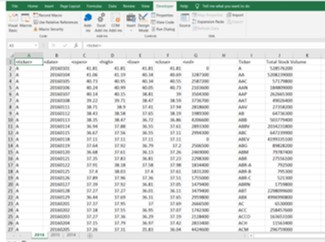

# VBA
Stock Evaluations by VisualBasic 
# The VBA of Wall Street

## Background
You are well on your way to becoming a programmer and Excel master! In this homework assignment you will use VBA scripting to analyze real stock market data.

Background
VBA scripting was used to analyze real stock market data. 

Files
Test Data 
Stock Data 

Created a script that will loop through each year of stock data and grab the total amount of volume each stock had over the year.
Display of the ticker symbol to coincide with the total volume is included.

To do:
Need to create a script that will loop through all the stocks and take the following info.
Yearly change from what the stock opened the year at to what the closing price was.
The percent change from the what it opened the year at to what it closed.
The total Volume of the stock
Ticker symbol
Should have conditional formatting that will highlight positive change in green and negative change in red.
This script version will also be able to locate the stock with the "Greatest % increase", "Greatest % Decrease" and "Greatest total volume".

